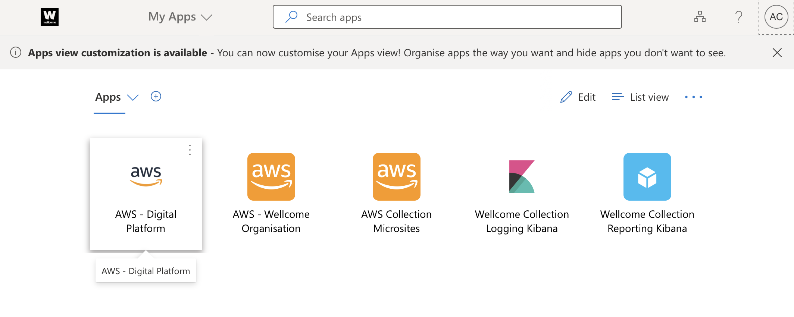
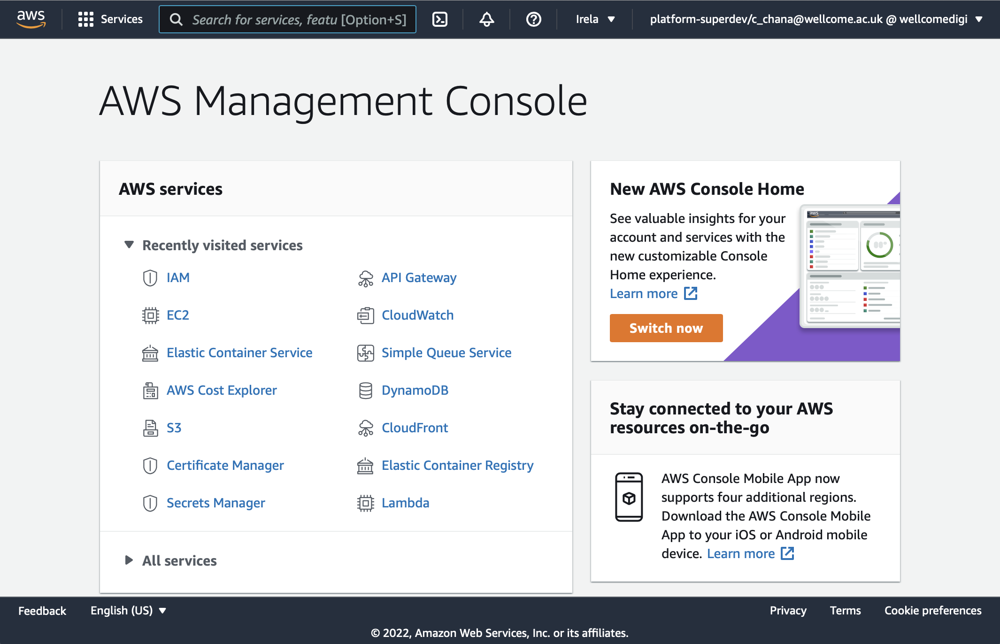
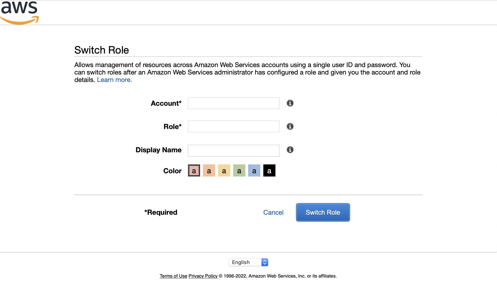

# How to log into an account using the AWS console

1.  Visit <https://myapps.microsoft.com/>.
    Log in using your `c_` account, e.g. `c_chana@wellcome.ac.uk`.

2.  You should see a list of apps.
    Click the app named "AWS - Digital Platform".

    If you can't see that app, it means you don't have access to our AWS accounts.
    Talk to a/another developer.

    

3.  You should be taken to the AWS console.

    

4.  Your default role can't do anything; it can only assume specific roles in other accounts.
    To assume a role, click the menu in the top right-hand corner, and click "Switch Role".

    

5.  You should be taken to a "Switch Role" screen.
    Enter the account ID and name of the role you want to assume, then click "Switch Role".

    
