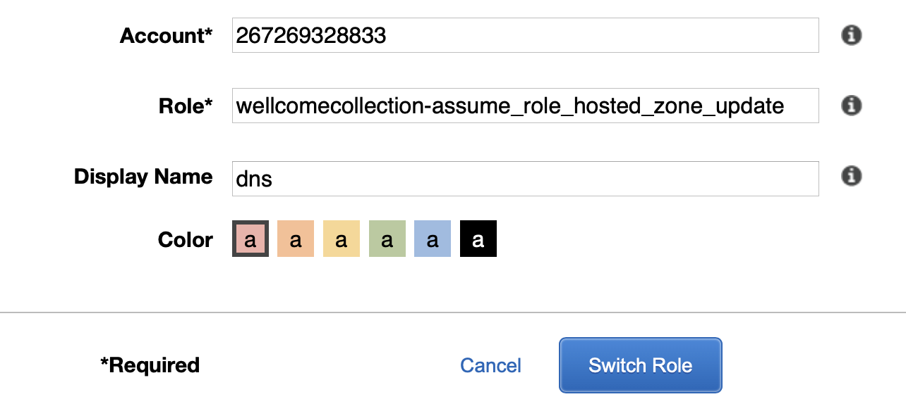

# wellcomelibrary.org

This is the CloudFront distribution for the old `wellcomelibrary.org` website.
It includes the code for redirecting users from the old site to the appropriate `wellcomecollection.org` URL.

## Key pieces

*   The CloudFront distributions are in the platform account.
    We have one distribution per subdomain of `wellcomelibrary.org` (e.g. `archives.wellcomelibrary.org`, `catalogue.wellcomelibrary.org`).

*   Each CloudFront distribution is connected to a Lambda@Edge function (defined in `edge-lambda`), which decides whether to redirect the user to the new site, or forward them to the old site.

    (We use Lambda@Edge instead of CloudFront Functions because we sometimes need to make HTTP requests before doing a redirect.
    e.g. looking up a b-number from a URL so we can find the appropriate works page.)

*   The Route 53 hosted zone for wellcomelibrary.org is defined in a D&T account.
    We create DNS records in that hosted zone that point to our CloudFront distributions.

## Key subdomains/services

*   `blog.wellcomelibrary.org` was the Wellcome Library blog.
    It's been backed up in the Wayback Machine by the Internet Archive, and we redirect requests to the archived version.

*   Encore was a web front-end for the library catalogue/Sierra, available at both `search.wellcomelibrary.org` and `wellcomelibrary.org` (no subdomain).
    As of January 2022, we are not redirecting Encore URLs.
    We will eventually redirect requests to the Works pages on the new website.

*   The OPAC ([online public access catalogue][opac]) was another web front-end for the library catalogue/Sierra, available at `catalogue.wellcomelibrary.org`.
    As of January 2022, we are not redirecting OPAC URLs, and we have no immediate plans to do so.

*   DServe was a web front-end for the archive catalogue/CALM, available at `archives.wellcomelibrary.org`.
    We redirect requests to the Works pages on the new website.

[opac]: https://en.wikipedia.org/wiki/Online_public_access_catalog

## Getting to the Route 53 Hosted Zone

The Route 53 Hosted Zone for wellcomelibrary.org is defined in a D&T account.

You can get to the Hosted Zone by assuming the following role: `arn:aws:iam::267269328833:role/wellcomecollection-assume_role_hosted_zone_update`.



You can see the Hosted Zone by going to <https://console.aws.amazon.com/route53/v2/hostedzones?#ListRecordSets/Z78J6G8RSOLSZ>

(You can't find the hosted zone in the Route 53 console because we don't have the ListHostedZones permission – some of them are for domains we don't control.)

## How to deploy the redirects

1.  Create a ZIP package for the Lambda definition, which is uploaded to S3:

    ```console
    $ cd edge-lambda/
    $ yarn deploy
    ...
    Finished uploading dist/wellcome_library_redirect.zip to s3://wellcomecollection-edge-lambdas/wellcome_library/wellcome_library_redirect.zip
    ```

2.  Apply the Terraform changes:

    ```console
    $ cd terraform/

    $ terraform plan -out=terraform.plan
    # review the changes

    $ terraform apply terraform.plan
    ```

    This will deploy the new version of the redirects to the *staging* domains.
    The new versions will be returned as an output:

    ```
    stage_lambda_function_versions = {
      "archive" = "28"
      "blog" = "45"
      "encore" = "24"
      "passthru" = "61"
      "wellcomelibrary" = "80"
    }
    ```

    We have [multiple versions of the Lambda@Edge functions][versions].
    When you upload a new zip package and run Terraform, it creates a new version.
    The staging domains always use the latest version, whereas the prod domains use a pinned version.

3.  Test the redirects in staging:

    ```console
    $ cd edge-lambda/
    $ yarn testRedirectsStage
    ```

4.  Update the versions of the Lambda functions in prod in `lambda_versions.tf`, using the versions output from Terraform above.
    Then do another Terraform plan/apply.

5.  Test the redirects in prod:

    ```console
    $ cd edge-lambda/
    $ yarn testRedirects
    ```

[versions]: https://docs.aws.amazon.com/lambda/latest/dg/configuration-versions.html
