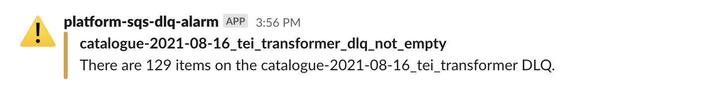
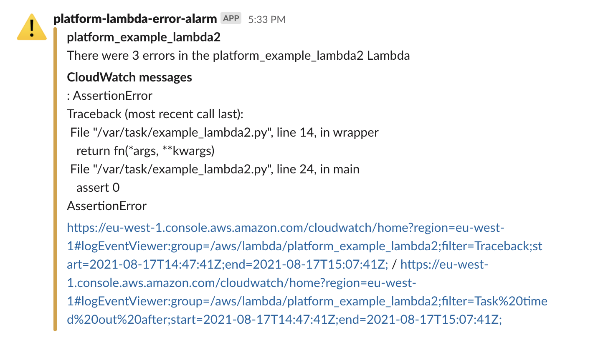
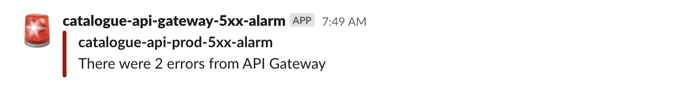

# slack_alerts

This is a collection of Lambda functions that send alerts to our Slack channels when something is broken.

Rough architecture:

We define a series of CloudWatch Alarms, which monitor metrics from a variety of places, and take action when a metric hits some particular threshold.
One of the actions is to send a notification to an SNS topic, which triggers one of the Lambda functions defined in this directory.
That function sends a message to our Slack channel, so we know to act on it.

## Examples

We get warnings when SQS queues are non-empty:

We get warnings when Lambda functions have an error, which include links to CloudWatch Logs from the time of the error:

We get alerts when there are 5XX errors through API Gateway:

## Implementation notes

*   We have one topic/Lambda function per account, so we don't have to deal with cross-account permissions for the CloudWatch-to-SNS topic notification.
*   The ARNs of the per-account DLQ alarm topics are published as outputs from the `monitoring` stack.

## Run locally (with UV)

These Lambda handlers are deployed **buildlessly** by Terraform (it zips each `*/src/` folder and sets the handler to `<module>.main`).
To keep that deployment mechanism unchanged, local execution is provided by a small runner project in this folder.

### Safety first

Local runs **do not send to Slack by default**.

*   By default the runner monkey-patches `urllib.request.urlopen` and prints the payload instead.
*   To actually send, you must pass `--send`.

### Python version

This folder contains a `.python-version` file pinned to Python 3.9 to match the Lambda runtime.
If you use `uv`, it will try to honour that version.

### Example runs

From `monitoring/slack_alerts/`:

*   Auth0 log stream alert:

	`uv run slack-alert-auth0 --event events/auth0_log_stream_alert_sns.json`

*   ECS tasks can't start alert:

	`uv run slack-alert-ecs-tasks --event events/ecs_tasks_cant_start_eventbridge.json`

*   Lambda errors to Slack alert:

	`uv run slack-alert-lambda-errors --event events/lambda_errors_to_slack_alerts_sns.json`

*   Metric to Slack alert (env vars can be overridden with `--set-env KEY=VALUE`):

	`uv run slack-alert-metric --event events/metric_to_slack_alert_sns.json`

### Avoiding AWS calls

The deployed Lambdas read the Slack webhook URL from AWS Secrets Manager.
For local runs you can avoid AWS credentials by providing a webhook URL override:

`--webhook-url https://hooks.slack.com/services/...`

### Optional dependencies

The helper script `auth0_log_stream_alert/src/download_log_event_type_codes.py` uses `requests` + `beautifulsoup4`.
These are not required for the deployed Lambda handler; if you want to run that script locally, install the optional `tools` extra.

## How to deploy

The Lambdas are automatically deployed when you run `terraform apply` in the monitoring stack.
