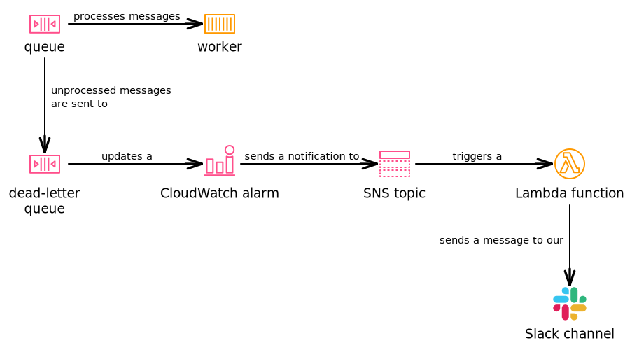

# dlq_to_slack_alerts

A lot of our services are workers backed by SQS queues.

If a worker is unable to process a message, the message is sent to a [dead-letter queue (DLQ)][dlq] using an SQS redrive policy.
If there are messages on the DLQ, this moves a CloudWatch alarm into the "In Alarm" state, which posts a notification to an SNS topic.
(This is set up automatically by our [Terraform SQS queue module][sqs_module].)

The SNS topic is a "DLQ alarm" topic, used by all the queues within a single account.
The topics are defined as part of the `monitoring` stack in this repo.

Notifications sent to this topic trigger this Lambda function, which sends a message to a shared Slack channel so we can see that something is up.

[dlq]: https://docs.aws.amazon.com/AWSSimpleQueueService/latest/SQSDeveloperGuide/sqs-dead-letter-queues.html
[sqs_module]: https://github.com/wellcomecollection/terraform-aws-sqs

## Implementation notes

*   We have one topic/Lambda function per account, so we don't have to deal with cross-account permissions for the CloudWatch-to-SNS topic notification.
*   The ARNs of the per-account DLQ alarm topics are published as outputs from the `monitoring` stack.

## How to deploy

The Lambda is automatically deployed when you run `terraform apply` in the monitoring stack.
